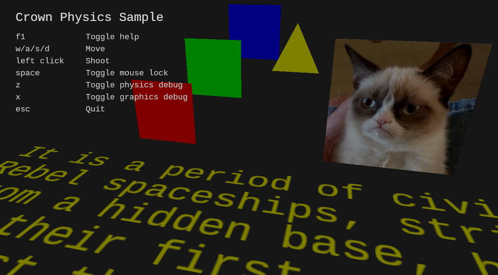
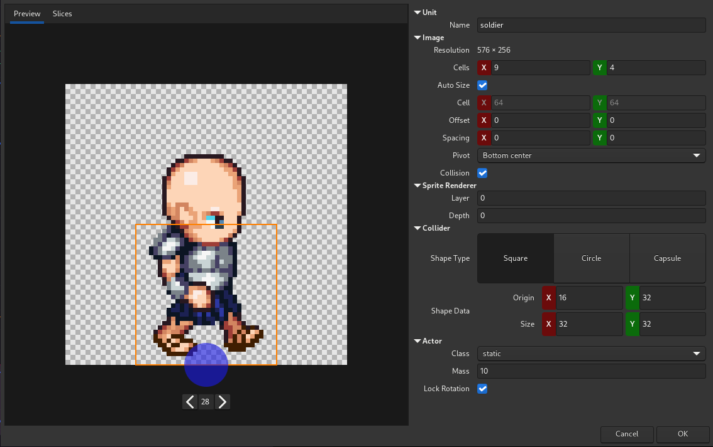

Crown 0.53 is out with a new API for 3D GUIs, conditional render states, refined Sprite and Font
importers, thumbnails in the Project Tree and many Runtime fixes:

  * 📜 [Changelog](https://docs.crownengine.org/html/v0.53.0/changelog.html#nov-2024)
  * 💾 [Download](https://crownengine.org/download)
  * ❤️ [Donate](https://crownengine.org/fund)

