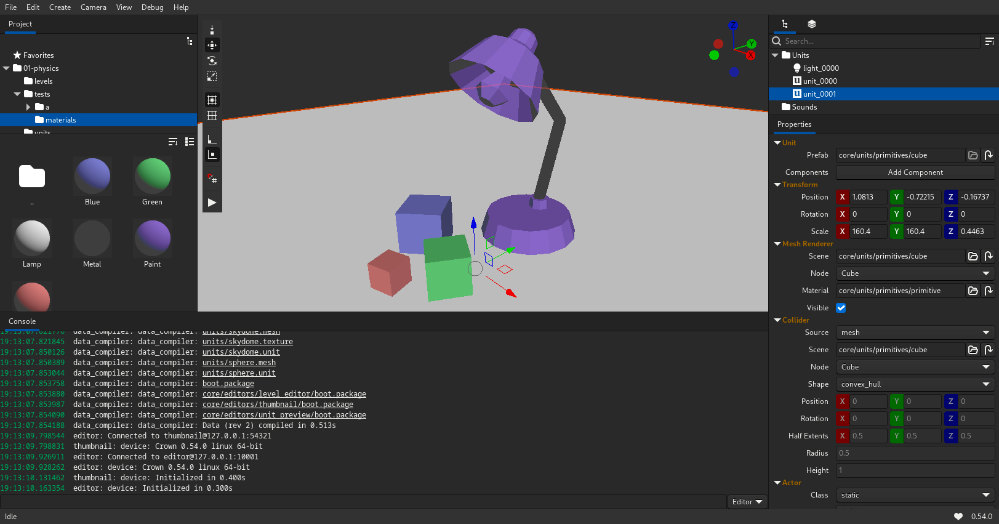

Right-handed Z-up world coordinates, an FBX scene importer, a strengthened SJSON parser and Data
Compiler, a greatly improved Project Browser, enhanced support for Units with children, and many
other improvements and fixes:

  * 📜 [Changelog](https://docs.crownengine.org/html/latest/changelog.html#jan-2025)
  * 💾 [Download](https://crownengine.org/download)
  * ❤️ [Donate](https://crownengine.org/fund)

P.S: Lamp model from ufbx library docs.
