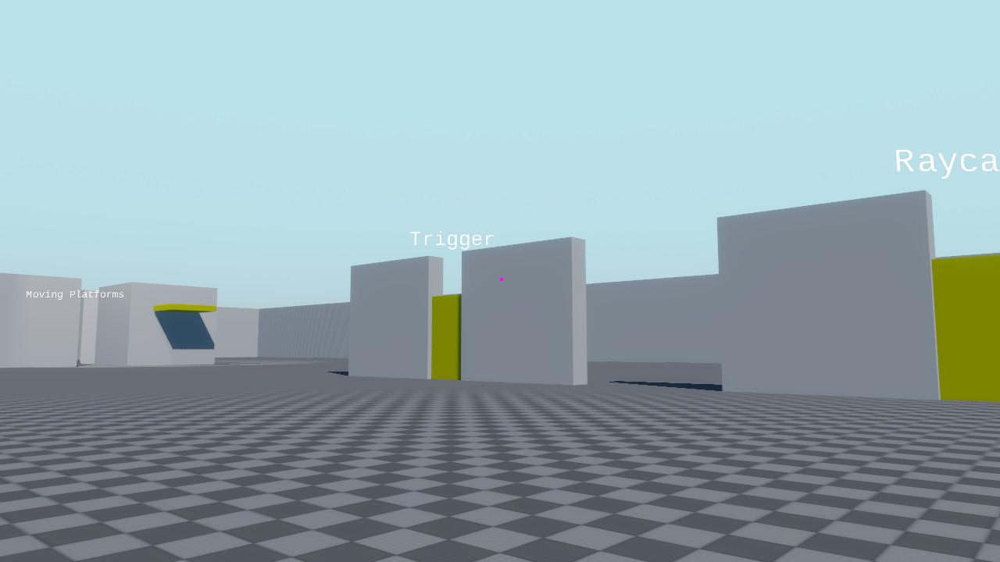

import DownloadButton from "../components/download-button.jsx"
import DonateButton from "../components/donate-button.jsx"

Spotlight shadows, global lighting, bloom, MSAA, a new physics Mover for controlling characters,
improved 3D sound spatialization, redesigned scripting component callbacks, a new Writing Gameplay
manual section, and the usual batch of bug fixes.

  <DownloadButton>Download Crown 0.59</DownloadButton> <DonateButton/>

Moreover, the 01-physics sample has been updated to showcase several new features. Play it on your
browser at [https://www.crownengine.org/play](https://www.crownengine.org/play).

  * 📜 [Changelog](https://docs.crownengine.org/html/latest/changelog.html#oct-2025)
  * 💾 [Download](https://crownengine.org/download)
  * 👍 [Follow](https://x.com/crown_engine)
  * ❤️ [Donate](https://crownengine.org/fund)

