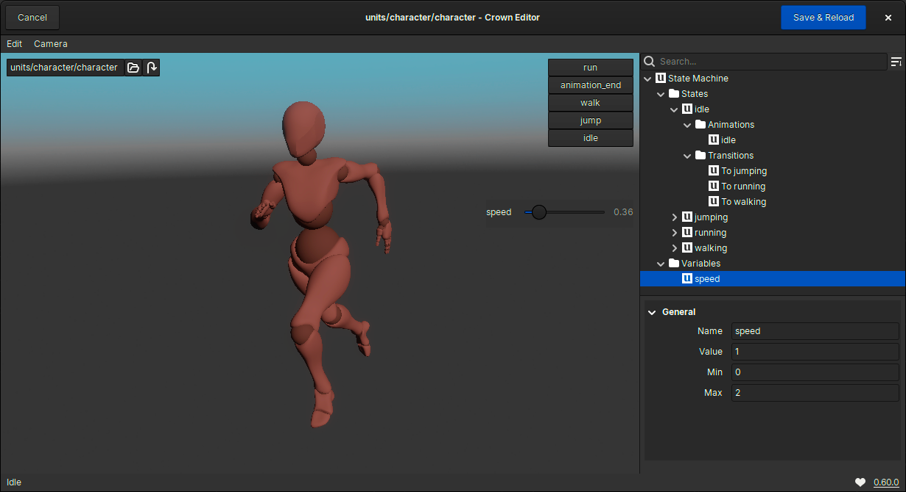
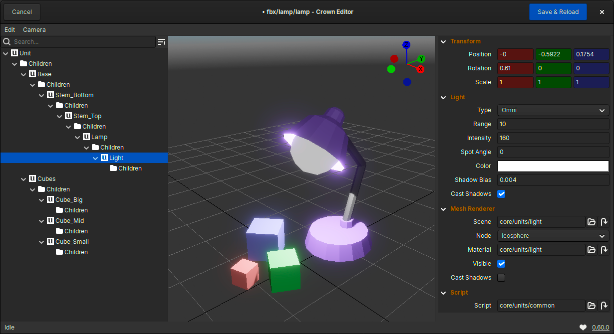

import DonationBox from "../components/donation-box.jsx"
import DownloadButton from "../components/download-button.jsx"

# What's New

Crown 0.60 is out! This major update introduces significant new features and
improvements throughout the engine. A **brand new Unit Editor** has been added
for editing prefabs, along with a **State Machine Editor** for configuring
complex 3D skeletal animations. 

Animation State Machine Editor

Additionally, the Project Browser now features a **Global Search Bar**, making
it much easier to work with large projects full of assets. The Level Tree has
also been enhanced with improved search functionality. On the Runtime side, you
will be pleased to know that **Shadow Maps** has been implementd for
omni-directional lights.

On top of that, a total of **29 bugs have been fixed** in this release. Take a
look at the [latest changelog](https://docs.crownengine.org/html/latest/changelog.html#v0-60-0) for
the full list of goodies!

Unit Editor

<DownloadButton />

# Thanks!

If you appreciate our work, please consider supporting us with a small donation.
It truly makes a difference!

<DonationBox />
