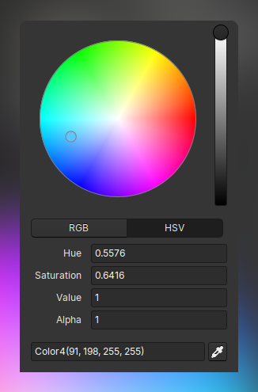

import DonationBox from "../components/donation-box.jsx"
import DownloadButton from "../components/download-button.jsx"

# What's New

This release upgrades the Linux rendering backend of Crown to a
full **Vulkan** solution. That gives us a clean path for future performance
work and fixes compatibility issues with tricky but increasingly common
setups like **XWayland + NVIDIA** where the old GL backend wasn't doing
well.

Crown now uses Vulkan for rendering on Linux!

In this update we added **15 new manual pages**, covering [how](https://docs.crownengine.org/html/latest/importing_resources/index.html) to [import](https://docs.crownengine.org/html/latest/importing_resources/importing_sprites.html)
[resources](https://docs.crownengine.org/html/latest/importing_resources/importing_textures.html), many [Level](https://docs.crownengine.org/html/latest/level_editor/level_viewport.html) [Editor](https://docs.crownengine.org/html/latest/level_editor/inspector.html) [features](https://docs.crownengine.org/html/latest/level_editor/level_tree.html), and [various](https://docs.crownengine.org/html/latest/rendering/lighting.html) [other](https://docs.crownengine.org/html/latest/physics/rigid_bodies.html) [topics](https://docs.crownengine.org/html/latest/level_editor/texture_settings.html) to help you get up to speed faster.

Our favorite figure from the new documentation pages

Crown 0.61 also brings a much-needed **HSV color picker**, a new **flythrough
camera mode** for zipping around viewports, and lots of small **tweaks and fixes**
across the editor.

The new HSV color picker

As always, check out the [latest
changelog](https://docs.crownengine.org/html/latest/changelog.html#v0-61-0) to see the full list of improvements and fixes. And don't forget to hop into our [discord](https://discord.gg/invite/CeXVWCT) server and share your thoughts on the new stuff!

<DownloadButton />

# Join the Development Fund

If you're enjoying Crown and want to see more, consider chipping in - it helps
keep the project moving.

<DonationBox />
