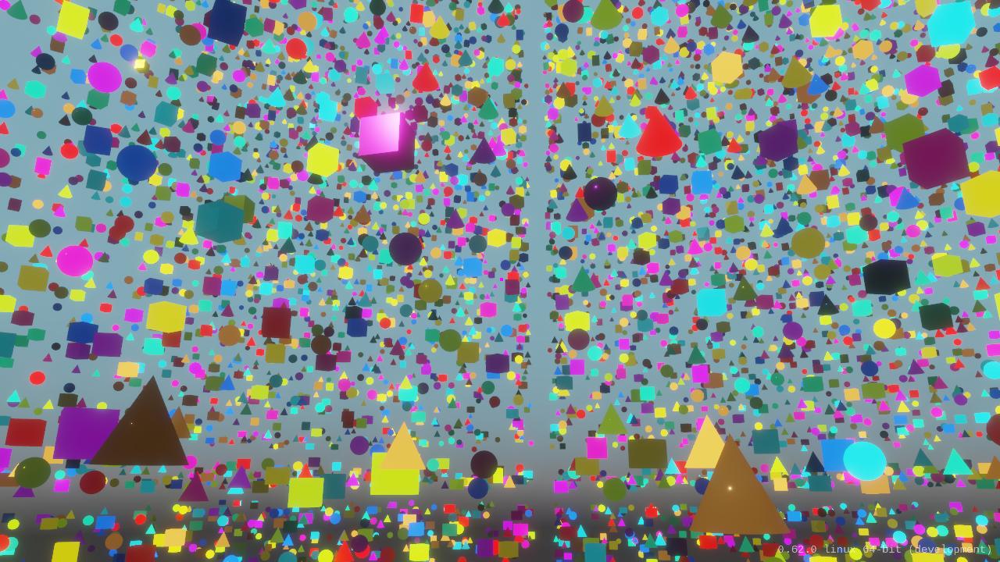
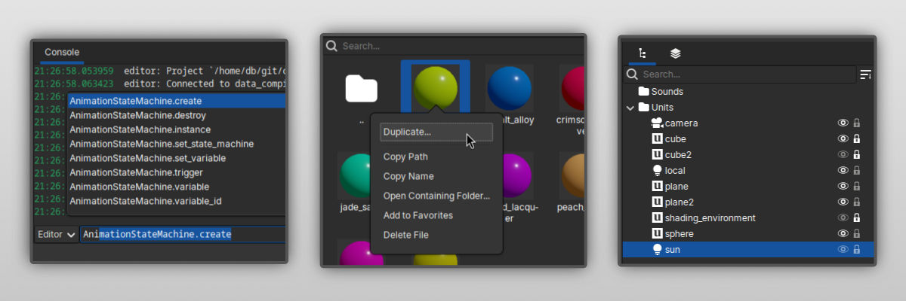

import DonationBox from "../components/donation-box.jsx"
import DownloadButton from "../components/download-button.jsx"

## What's New

Crown 0.62 is out! This release makes day-to-day work in the editor smoother, improves runtime
behavior in larger scenes, and expands input support across platforms.

On the runtime side, Crown 0.62 refactors the **Mover component**, adding new features while
substantially improving robustness. It also includes **frustum-culling work** that improves
performance in levels with large numbers of units.

Large levels now perform better thanks to frustum-culling improvements

Input support expands across platforms: **Android** now supports keyboard, mouse and joypad input.
**HTML5** also gains joypad input support: try it on the [updated physics
sample](https://play.crownengine.org/physics) and tell us if you encounter any issues.

Inside the editor, the Console command bar can now **suggest completions** while typing Lua
expressions, resources can be **duplicated** straight from the Project Browser, and objects can now
be **hidden** or **locked** from the Level Tree.

Console completions, Project Browser duplication, and Level Tree hide/lock controls

Full documentation in both **HTML** and **reStructuredText (RST)** format is now bundled directly in
the binary packages to avoid depending on continued internet access and also help feeding LLMs
faster.

This release also includes **23 fixes** across the editor, runtime, data compiler and Lua API. That
covers issues like flythrough camera stutters, HTML5 text fringe, Linux joypad and keyboard quirks,
slow shader/material compilation, and more.

As always, check out the [latest
changelog](https://docs.crownengine.org/html/latest/changelog.html#v0-62-0) for the complete list of
improvements and fixes.

<DownloadButton />

## Join the Development Fund

If you're enjoying Crown and want to see more, consider chipping in - it helps
keep the project moving.

<DonationBox />
